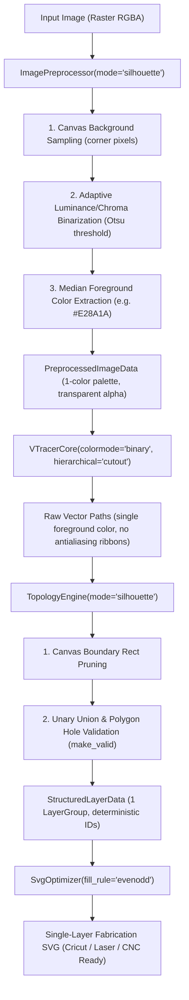

# Design Specification: Silhouette & Decal Vectorizer Mode

**Date**: 2026-10-09  
**Status**: APPROVED_IN_BRAINSTORMING  
**Target Subsystems**: `inkmcp.vectorizer`, `inkmcp.inkmcpops`, `inkmcp.inkscape_mcp_server`, `inkmcpcli`

---

## 1. Executive Summary & Problem Statement

### 1.1 Context
In vinyl cutting (Cricut, Silhouette Cameo, Roland), single-layer laser engraving, and CNC routing, users frequently import raster designs that are fundamentally monochromatic or single-subject silhouettes with fine internal cutouts (such as mandalas, filigree pumpkins, and line art).

### 1.2 The Problem
When such images are processed through standard multi-color vectorization pipelines (`mode="cut_ready"` with $k=8$ color quantization):
1. **Antialiasing Noise Layers**: Sub-pixel gradient transitions between the foreground artwork and the background canvas are falsely clustered into 3–5 intermediate tint layers (e.g. pale cream `#F5E8CD`, warm amber `#E7AE60`, light peach `#EDC489`).
2. **Path Perforation & Splotches**: In cut-ready planar difference, these antialiased ribbons are cut out from the primary body, fragmenting clean, continuous curves into brittle, perforated strips.
3. **Unwanted Canvas Layer**: The background canvas (e.g. 600×400 white rectangle) is converted into a vector layer, which is useless for a decal or laser cutout.
4. **Watermark / Promotional Text Contamination**: Marketplace preview text (e.g. "SVG. PNG. PDF") is rendered as part of the primary graphic.

### 1.3 The Goal
Implement a dedicated **`silhouette`** mode (available as `mode="silhouette"`) across the vectorizer pipeline that:
- Automatically distinguishes foreground from background without multi-color clustering.
- Binarizes antialiased transition edges cleanly via adaptive thresholding.
- Discards the outer canvas rectangle entirely.
- Generates a single, pristine cut layer (`01 - <color_hex>`) with all internal voids preserved as compound polygon holes.
- Retains full backward compatibility with `cut_ready` and `layered` modes.

---

## 2. Architecture & Data Flow



---

## 3. Detailed Component Specifications

### 3.1 `ImagePreprocessor` (`inkmcp/vectorizer/preprocessor.py`)
- **Signature Update**:
  ```python
  def process(
      self,
      image_input: Union[str, Path, Image.Image],
      num_colors: int = 8,
      remove_background: bool = False,
      mode: str = "cut_ready",
  ) -> PreprocessedImageData:
  ```
- **Silhouette Logic**:
  1. If `mode == "silhouette"`:
     - Sample the 4 corner pixels `[(0, 0), (w-1, 0), (0, h-1), (w-1, h-1)]` to determine background color $C_{\text{bg}}$ and background variance.
     - Compute Euclidean color distance from $C_{\text{bg}}$ across all pixels.
     - Apply edge-preserving bilateral filtering to suppress single-pixel sensor noise.
     - Compute an optimal binary threshold using Otsu's method on the distance map.
     - Pixels with $\text{distance} > \text{threshold}$ are classified as foreground; all others are transparent background (`alpha=0`).
     - Calculate the median RGB value of all foreground pixels to extract the canonical color hex $C_{\text{fg}}$ (e.g. `#E28A1A`).
     - Set `palette = [C_fg]`.
     - Construct a single binary mask in `color_masks[C_fg]`.
     - Return `PreprocessedImageData(image=cleaned_image, palette=[C_fg], color_masks={C_fg: mask}, dimensions=(w, h))`.

### 3.2 `VTracerCore` (`inkmcp/vectorizer/core.py`)
- When `mode == "silhouette"`:
  - Input image has transparent background and solid foreground.
  - VTracer runs with `hierarchical="cutout"`, `filter_speckle=4`.
  - Contours are traced strictly around the binary boundaries, producing clean Bezier splines without intermediate color fringes.

### 3.3 `TopologyEngine` (`inkmcp/vectorizer/topology.py`)
- **Signature Update**:
  `TopologyEngine.process` allows `mode in ("cut_ready", "layered", "silhouette")`.
- **Silhouette Logic**:
  1. Verify paths belong to single canonical foreground color.
  2. Filter out any path whose bounding box equals the full canvas dimensions `(0, 0, w, h)` with area $\ge 0.98 \times (w \times h)$ (canvas bounding rectangle).
  3. Combine all remaining paths via `shapely.ops.unary_union`.
  4. Ensure geometric validity via `shapely.validation.make_valid`.
  5. Convert resulting MultiPolygon / Polygon into a single `LayerGroup`:
     - `layer_id = "layer_01"`
     - `label = f"01 - {canonical_hex}"`
     - `color_hex = canonical_hex`
     - `z_index = 1`
  6. Return `StructuredLayerData(layers=[layer_01], dimensions=dimensions, mode="silhouette")`.

### 3.4 `SvgOptimizer` (`inkmcp/vectorizer/optimizer.py`)
- In `SvgOptimizer.build_svg`:
  - When rendering `<path>` elements, include attribute `fill-rule="evenodd"`.
  - Guarantees that cutting software (Cricut Design Space, Silhouette Studio, LightBurn) properly interprets all internal loops as transparent cut holes.

### 3.5 Interface & Operations Dispatcher
- **`inkmcp/inkmcpops/vectorize_operations.py`**:
  - Accept `mode="silhouette"` in `params`.
  - Pass `mode=mode` to `ImagePreprocessor.process(...)` and `TopologyEngine.process(...)`.
- **`inkmcp/inkscape_mcp_server.py`**:
  - Update `@mcp.tool() async def vectorize_image(...)` docstring and validation to document `mode: str = "cut_ready"` (`"cut_ready"`, `"layered"`, or `"silhouette"`).
- **`inkmcp/inkmcpcli.py`**:
  - Update argument parsing and help text to document `--mode silhouette`.

---

## 4. Verification & Testing Strategy

### 4.1 Automated Tests
1. `tests/test_vectorizer_preprocessor.py`:
   - `test_preprocessor_silhouette_mode`: Verifies background detection, single canonical foreground extraction, zero antialiasing cluster creation, and transparent alpha output.
2. `tests/test_vectorizer_topology.py`:
   - `test_topology_silhouette_mode`: Verifies that a compound shape with holes produces exactly 1 layer group, 0 canvas bounding rectangles, and preserves interior void loops.
3. `tests/test_vectorize_operations.py`:
   - `test_vectorize_operation_silhouette_mode`: Tests full pipeline execution in silhouette mode.
4. `tests/test_vectorize_cli.py`:
   - `test_cli_silhouette_mode`: Tests CLI execution with `--mode silhouette`.

### 4.2 Live Asset Verification (`media_1791565153197_eb484739.png`)
- Generate `filigree_silhouette.svg`.
- Assert layer count is strictly **1**.
- Assert antialiasing splotch layers count is strictly **0**.
- Assert full canvas rectangle count is strictly **0**.
- Render to PNG via Inkscape CLI (`render_filigree_silhouette.png`).
- Load into active desktop Inkscape instance and capture `inkscape_filigree_silhouette_certified.png`.
- Full regression suite run (`pytest tests/ -v`, asserting 233+ tests pass with Exit Code 0).
